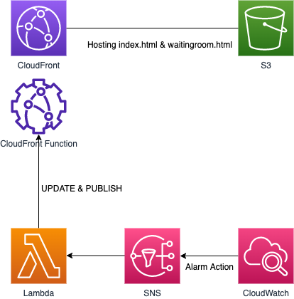

# Visitor Prioritization Switcher

Amazon CloudFront Function is used to achieve [Visitor Prioritization](https://aws.amazon.com/jp/blogs/news/visitor-prioritization-by-cloudfront-functions/). however operators need to turn on/off the functionalities manually by AWS management console.
This samples shows how to do it automatically according to Amazon CloudWatch metrics, such as request count per minute.

## Architecture



Amazon CloudWatch triggers AWS Lambda when the alarm kicks off and the AWS Lambda function update and publish the Amazon CloudFront Function. 
In this sample, the alarm kicks according to the request count to the Amazon CloudFront distribution. Please customize the metrics as you like.
Also, You can customize how much of requests should be guided to the waiting room by adjusting the environment variable `HITRATE_LIMITED` for the AWS Lambda function. Please check [CDK source](lib/monitor.ts) too.

## Deployment

Install dependencies

```
npm install
```

Bootstrap the AWS CDK

```
npm run cdk -- bootstrap --region us-east-1
```

Deploy the stack

```
npm run cdk deploy WaitingroomStack
```

If the deployment is successful, the CloudFront endpoint will be shown. Please access it with your favorite web browser.  Reloading many times will trigger the alarm and you will be guided to the waitingroom.


## Security

See [CONTRIBUTING](CONTRIBUTING.md#security-issue-notifications) for more information.

## License

This library is licensed under the MIT-0 License. See the LICENSE file.

